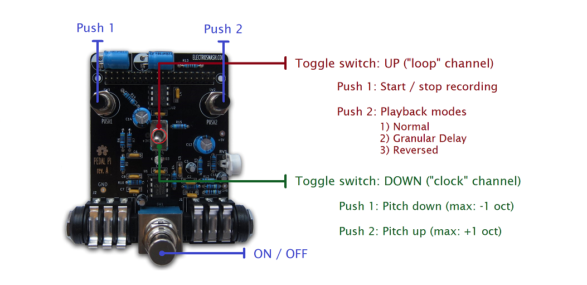

# Pedal Pi Granular Sampler

A granular delay / micro-sampler script inspired by guitar pedals like [Chase Bliss Mood](https://www.chaseblissaudio.com/shop-pedals/mood) or [Count to 5](https://mtlasm.com/product/count-to-5/) and designed for the [Electrosmash Pedal Pi](https://www.electrosmash.com/pedal-pi) project with Raspberry Pi Zero.

This audio effect is an original design, based on a project I made for my BSc thesis on audio signal distortion.


### Controls

The effect is divided into two communicating stages:

1) By selecting the `TOGGLE_SWITCH` in "UP" position, you will enter the *loop* channel.
    * `PUSH_1`: 
    
        Starts / stops the recording. As you stop the recording, the slice of audio will start looping. 
    
        The `LED` will start blinking while in recording mode. The max length of the recording buffer is 5 seconds, so once you max out the maximum recording length the buffer will store only the last 5 seconds. 

        There is also no overdubbing, so recording over an existing loop will replace the entire loop.

    * `PUSH_2`:

        Switches between three different playback modes:

        1) **Normal**: the recording starts looping back as it is.

        2) **Granular Delay**: the most fun and unpredictable mode; this will break, freeze and scatter the stored audio into little pieces. The size, position and direction of the grains is sometimes randomized, sometimes controlled by an LFO. There's also an always-on delay effect on top of the granular loop, to help diffuse the sound into a denser texture.

        3) **Reversed**: inspired by reel-to-reel tape machines, this will reverse the entire looping. Works really well with half-speed playback.


2) When the `TOGGLE_SWITCH` is in "DOWN" position, you will enter the *clock* channel. 

    This channel will affect the clock rate, as it's directly linked to the playback speed of your recorded piece of audio (for example, if you set the pitch one octave down it will halve the clock rate, and consequentely the playback speed). This will produce some interesting glitchy effects, due to the lo-fi nature of the 12-bit ADC.
    You can adjust the speed only in pre-defined harmonic steps of 3rds, perfect 5ths and octaves.
    
    * `PUSH_1`: 
    
        Pitches down the loop. The subsequent intervals are: -5 semitones (perfect 5th), -12 st. (full octave). 
    
    * `PUSH_2`:

        Pitches up the loop. The subsequent intervals are: +4 semitones (major 3rd), +7 st. (perfect 5th), +10 st. (minor 7th), +12 st. (full octave).

    Keep in mind that the pitch control will only affect your recorded piece of audio, not the input signal. So if you haven't recorded anything yet, this channel won't produce any effect.

### Visual diagram / manual:



## Purchasing and setup
### 1. Shop

* [Pedal Pi full kit](https://shop.electrosmash.com/product/pedal-pi-kit/)
* [Raspberry Pi Zero](https://www.raspberrypi.com/news/raspberry-pi-zero-w-joins-family/) (chip)

Visit the Electrosmash [website](https://www.electrosmash.com/pedal-pi) for all the circuit details and assembling tutorial.

### 2. Installation and running
 
You would need to install the Operating System (Raspbian) and the libraries (BCM2835). Full instructions available on this [webpage](https://www.electrosmash.com/forum/pedal-pi/202-how-to-start-programming-pedal-pi?lang=en).

Then you would need to install git on your Raspberry to clone the repository:
``` sh
sudo apt update
sudo apt install git
```

Cloning the repo:
``` sh
git clone https://github.com/EnrcDamn/granular-sampler-pedal-pi.git
cd granular-sampler-pedal-pi
```

Compiling and executing the script:
``` sh
gcc granular_sampler.c -o granular_sampler -l bcm2835 -lm
sudo ./granular_sampler
```

