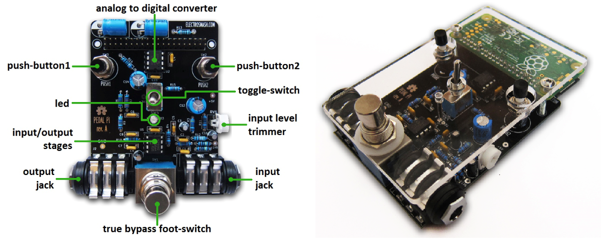

# Pedal Pi Granular Sampler

A granular delay / micro-sampler script inspired by guitar pedals like [Chase Bliss Mood](https://www.chaseblissaudio.com/shop-pedals/mood) or [Count to 5](https://mtlasm.com/product/count-to-5/) and designed for the [Electrosmash Pedal Pi](https://www.electrosmash.com/pedal-pi) project with Raspberry Pi Zero.


--- to be finished ---



## 1. Shop

* [Pedal Pi full kit](https://shop.electrosmash.com/product/pedal-pi-kit/)
* [Raspberry Pi Zero](https://www.raspberrypi.com/news/raspberry-pi-zero-w-joins-family/) (chip)

Visit the Electrosmash [website](https://www.electrosmash.com/pedal-pi) for all the circuit details and assembling tutorial.

Pedal Pi Specifications:

* Based in Raspberry Pi Zero (1GHz ARM11 core).
* Analog stages using MCP6002 rail-to-rail operational amplifier.
* ADC: 12bits / Sampling Rate 50Ksps (MCP3202).
* Output Stage: 12 bits (2x6bits PWMs running in parallel)
* Pi Zero:
    * 1GHz ARM11 core.
    * 512MB of LPDDR2 SDRAM.
    * Micro-SD card slot.
* Connectors:
    * Input Jack, 1/4 inch unbalanced, Zin=0.5MΩ.
    * Output Jack, 1/4 inch unbalanced, Zout=100Ω.
    * Power supply: power taken from the Pi Zero board (micro-USB).

## 2. Installation and running
 
You would need to install the Operating System (Raspbian) and the libraries (BCM2835). Full instructions available on this [webpage](https://www.electrosmash.com/forum/pedal-pi/202-how-to-start-programming-pedal-pi?lang=en).

Cloning the repo:
``` sh
git clone https://github.com/EnrcDamn/granular-sampler-pedal-pi.git
sudo granular-sampler-pedal-pi
```

Compiling and executing the script:
``` sh
gcc granular_sampler.c -o granular_sampler -l bcm2835
sudo ./granular_sampler
```

